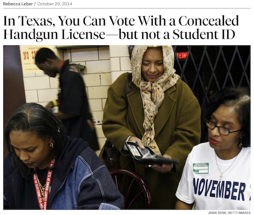
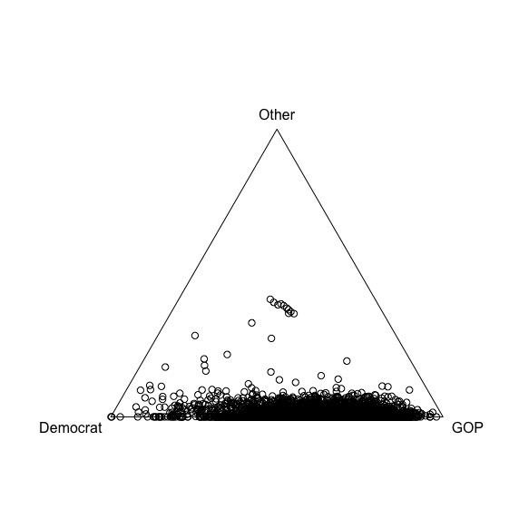
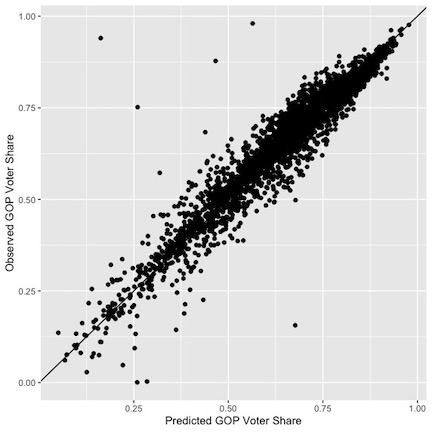
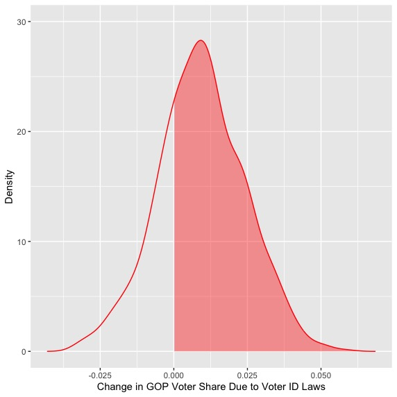
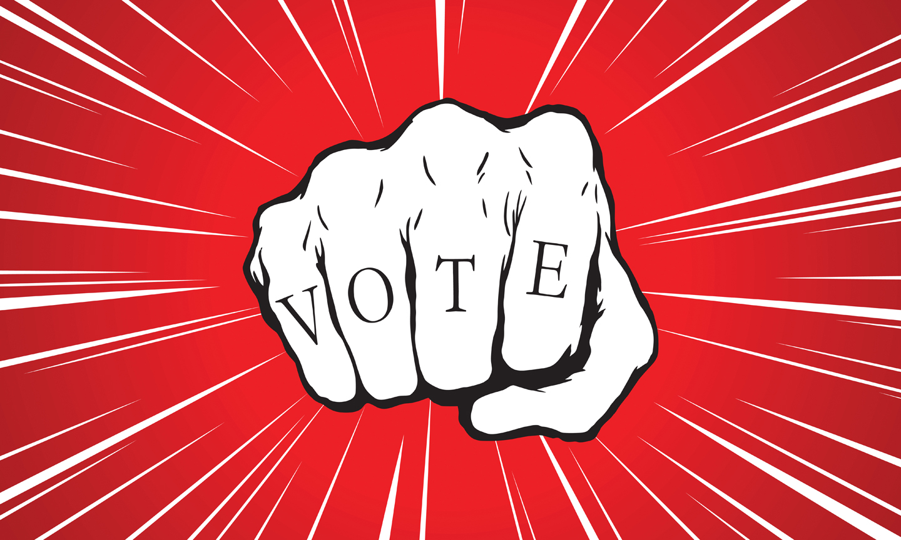

# What are Voter ID laws?

From [_The New Republic_](https://newrepublic.com/article/119900/texas-voter-id-allows-handgun-licenses-not-student-ids) by Rebecca Leber, October 20, 2014

.center[

]

---

# What are Voter ID laws?

--

In states where voter ID laws are in place, they vary considerably!

--

  - **Strict?** ID is required before a voter is eligible to cast a ballot
  
--

  - **Not strict?** ID is requested, though not required
  
--

Recently, more states have been adopting increasingly strict measures. Why?

--

  - voter fraud -- it is pervasive and must be stopped with definitive legal measures (such as voter ID laws)
  
--

  - counterpoint -- some say it is a new form of poll tax -- an effective means of suppressing targeted groups
  
---

# What are Voter ID laws?

```{r,echo=FALSE,message=FALSE,fig.align='center',fig.width=12}
library(tidyverse)
library(maps)
voterID.states <- 
  read.csv("/Volumes/PAY/Political Science/Liz 2020/Data/voterID-states.csv")
all_states <- map_data("state")
Total <- all_states %>%
  inner_join(voterID.states,by=c("region"="stateName")) %>%
  filter(region!="district of columbia") %>%
  mutate(VoterID=factor(VoterID,levels=c("None","Non-Strict","Strict")))

okabe <- c("#E69F00", "#56B4E9", "#009E73", "#F0E442", "#0072B2", "#D55E00", "#CC79A7")

ggplot()+
  geom_polygon(data=Total,aes(x=long,y=lat,group=group,fill=VoterID),color="white")+
  theme_bw()+labs(fill="Voter ID Law",title="Voter ID Law by State",x="",y="")+
  scale_fill_discrete(type=okabe)+
  scale_y_continuous(breaks=c())+scale_x_continuous(breaks=c())+ 
  theme(panel.border =  element_blank())
```

_Source:_ Data on state voter ID laws sourced from the National Conference of State Legislatures and the Brennan Center for Justice

---

# Voter ID: Causes & Consequences

--

What increases a state's likelihood of adopting ID laws?

--

  - significantly predicted by the racial and electoral composition of districts (McKee (2015) and Hicks et al. (2015))
  
--

  - change of control from Democratic state leadership to Republican in both the executive and legislative branches (Biggers and Hanmer (2017))
  
--

Consequences of adopting voter ID laws?

--

  - several studies found the presence of ID laws decreased turnout levels in general and particularly among historically marginalized groups (de Alth (2009) and Barreto, Nuno, and Sanchez (2009))
  
--

  - other studies found there could be factors that mitigate the negative effects on turnout (Vercellotti and Andersen (2009); Citrin, Green, and Levy (2014); de Alth (2009); Lynch and Bright (2017))
    - time for voters to become more aware and adjust to new voting requirements
    - active campaigns to increase awareness of changes in voting requirements
    
---
# Consequences: More Recent Work

--

  - Voter ID laws found to depress turnout on racial and ethnic minority groups across elections (Hajnal, Lajevardi, and Nielson (2017))
  
--

  - Voter ID laws found to have decreased the Democratic vote in two out of three elections (Burden et al. (2017))
  
--

  - Based on 2016 presidential election data, there is an estimated probability of 61% of a larger increase in voter share for the GOP than the Democratic candidate when voter ID laws are present (Bergman, Tran, and Yates (2018))
  
    - In fact, voter ID laws may attributed to Trump narrowly beating Clinton in Wisconsin in 2016
    
---
# Compositional Data

2016 United States presidential results in Vermont by county:

|**County**|**Clinton**|**Trump**|**Other**|
|:---|---:|---:|---:|
|Addison|0.590|0.278|0.132|
|Bennington|0.549|0.341|0.110|
|Caldeonia|0.458|0.393|0.149|
|Chittenden|0.657|0.223|0.120|
|Essex|0.348|0.515|0.137|
|Franklin|0.437|0.409|0.155|
|Grand Isle|0.510|0.362|0.129|
|Lamoille|0.567|0.280|0.153|
|Orange|0.515|0.342|0.143|
|Orleans|0.430|0.428|0.141|
|Rutland|0.460|0.421|0.118|
|Washington|0.598|0.257|0.145|
|Windham|0.634|0.241|0.126|
|Windsor|0.587|0.288|0.126|

---
# Logratio Analysis

The **additive logratio** (ALR) transformation is one way to handle compositional data.

Let $x=\left\{x_{1},\ldots,x_{D}\right\}\in S^{D}$ be a $D$-part composition. The ALR then takes
$$S^{D}\rightarrow R^{D-1}$$
In other words
$$y=ALR(x)=\left\{\log\left(\frac{x_{1}}{x_{D}}\right),\left(\frac{x_{2}}{x_{D}}\right),\ldots,\log\left(\frac{x_{D-1}}{x_{D}}\right)\right\}$$
**So?** The ratios involve the division of each of the first $D-1$ components by the final component.

---
# Voter Share & ALR

For the analysis of the U.S. presidential election at the county level, the response of interest is:
$$\mathbf{y}_{i}=\left[\log\left(\frac{V_{i,GOP}}{V_{i,Other}}\right),\log\left(\frac{V_{i,Dem}}{V_{i,Other}}\right)\right]^{T}$$where $V_{i}$ represents the voter share for a given party/candidate for the $i^{th}$ county
--

This idea works just fine for modeling voter share in presidential elections where third party candidates receive a non-zero percentage of the vote.

--

What about congressional races where only the Democrat and Republican candidates are involved?

--

  - **essential or structural zeros!**
  
---

# Structural Zeros

Structural zeros occur in many compositional data scenarios. These examples include (Aitchison and Kay (2003))

--

  - household budget patterns where some households may spend nothing on tobacco, alcohol, entertainment over the period of observation
  
--

  - time budgets where the subject may not take part in one or more of the assigned activities during the recording period
  
--

  - paleontology -- levels of a number of different varieties of the pollen fossils may be absent
  
--

  - ecological abundance studies where the abundances of different species are often expressed as percentages and for some regions some species are absent
  
--

Unfortunately analyzing the 2018 U.S. congressional races at the county level, there are plenty of structural zeros (see next slide)

---
# Ternary Diagram

.center[

]

---

# Structural Zeros

What do we do when structural zeros are present in compositional data?

--

For the congressional data set, all of the structural zeros occur in the "Other" dimension

--

We will adjust $V_{i,GOP}$ and $V_{i,Dem}$:
$$V_{i,GOP}^{\ast}=\frac{V_{i,GOP}}{V_{i,GOP}+V_{i,Dem}}\quad V_{i,Dem}^{\ast}=\frac{V_{i,Dem}}{V_{i,GOP}+V_{i,Dem}}$$

--

This then simplifies to a **logit** transformation!
$$Y_{i}=\log\left(\frac{V_{i,GOP}^{\ast}}{V_{i,Dem}^{\ast}}\right)$$where $Y_{i}$ is the log-odds of (adjusted) Republican support versus (adjusted) Democrat support in county $i$

---
# Back to Voter ID & Vote Share!

**Goal:** We want to be able to construct a model to quantify the change in expected voter share for the GOP due to voter ID laws.

--

  - **Response variable:** $Y_{i}$ -- the log-odds of (adjusted) Republican support versus (adjusted) Democrat support in county $i$

--

  - **Covariates:**
  
--
    - **Voter ID Laws:** indicator variable for the presence of voter ID laws in county $i$ -- this is nested within the state! A state-level predictor!
    
--

    - Logit transformed: GOP support (Republican vs. Democrat), Gender (female vs. not female); Unemployment (unemployed vs. employed); Education (less than a high school education vs. at least a high school education); Rural (rural vs. urban)

    - ALR transformed: Race (white vs. other, black vs. other, Hispanic vs. other); Age (age 29 & under vs. other, age 65 & older vs. other)
    
    - Standardized: Median household income
    
---
# A Proposed Model

A multilevel model (counties nested inside of states) can be implemented in the following manner:
$$Y_{i}\sim\mbox{Normal}\left(\mu_{i},\sigma^{2}\right),i=1,\ldots,2962$$
Here:
$$\mu_{i}=\alpha_{k[i]}+\sum^{11}_{p=1}\beta_{p}X_{ip}, i=1,\ldots,2962, k=1,\ldots,49$$
To fit this in a Bayesian framework, we need to assign prior distributions on the model parameters.

---
# A Proposed Model

Priors are:
$$
\begin{aligned}
\alpha_{k} & \sim\mbox{Normal}\left(\gamma_{0}+\gamma_{1}U_{k},\sigma_{\alpha}^{2}\right), k=1,\ldots,49 \\
\beta_{p},\gamma_{0},\gamma_{1} & \sim\mbox{Normal}\left(0,100^{2}\right), p=1,\ldots,11 \\
\sigma, \sigma_{\alpha} & \sim\mbox{Gamma}(r,\lambda) \\
r &= 1+m\lambda \\
\lambda &= \frac{m+\sqrt{m^{2}+4s^{2}}}{2s^{2}} \\
m, s &\sim\mbox{Uniform}(0,100)
\end{aligned}
$$
The gamma distribution is being parameterized by its mode and standard deviation.

--

A second model was also used with the model coefficients having a Cauchy prior distribution; however, the results were very similar to this model's results.

--

A burn-in of 1000 iterations was performed for model convergence, and then an additional 500,000 iterations were performed, taking every 500th observation, yielding 1000 observations generated from the converged posterior distribution.

---
```{r,eval=FALSE}
model{
    for(i in 1:n){
      Y[i] ~ dnorm(mu[i],tau.Y)
      mu[i] <- a[id[i]]+inprod(beta,X[i,])
    }
    tau.Y <- 1/pow(YSD,2)
    YSD ~ dgamma(sh.Y,ra.Y)
    # dgamma parameterized by mode (m) and standard deviation
    sh.Y <- 1+m.Y*ra.Y
    ra.Y <- (m.Y+sqrt(m.Y^2+4*sd.Y^2))/(2*sd.Y^2)
    m.Y ~ dunif(0,100)
    sd.Y ~ dunif(0,100)

    for(k in 1:nEff){
      beta[k] ~ dnorm(0,0.0001)
    }
    
    for(s in 1:S){
      a[s] ~ dnorm(a.hat[s],aTau)
      a.hat[s] <- g.0+g.1*VID[s]
    }
    
    aTau <- 1/pow(aSD,2)
    aSD ~ dgamma(sh,ra)
    # dgamma parameterized by mode (m) and standard deviation
    sh <- 1+m*ra
    ra <- (m+sqrt(m^2+4*sd^2))/(2*sd^2)
    m ~ dunif(0,100)
    sd ~ dunif(0,100)
    g.0 ~ dnorm(0,0.0001)
    g.1 ~ dnorm(0,0.0001)
    }
```

---
# Model Results

|**Coefficients**|**Posterior Mean**|**Posterior SD**|**95% Credible Set**|
|:---|---:|---:|:---:|
|_State-level:_|||| 
|   Intercept|-0.007|0.080|(-0.167,0.153)|
|   VID|0.041|0.065|(-0.091,0.167)|
|_County-level:_||||
|Past GOP Support|0.989|0.010|(0.971,1.006)|
|Race: White vs. Other|0.027|0.008|(0.012,0.042)|
|Race: Black vs. Other|-0.002|0.003|(-0.008,0.005)|
|Race: Hispanic vs. Other|-0.006|0.006|(-0.018,0.006)|
|Gender: Female vs. Not-female|-0.132|0.058|(-0.245,-0.024)|
|Age: 29 & Under vs. Other|0.017|0.034|(-0.047,0.081)|
|Age: 65 & Over vs. Other|0.036|0.030|(-0.023,0.094)|
|Median Household Income|-0.021|0.009|(-0.038,-0.003)|
|Unemployed|0.009|0.009|(-0.007,0.026)|
|Education: Less HS vs. At Least HS|0.071|0.017|(0.039,0.102)|
|Rural|0.003|0.001|(0.000,0.005)|

---
# Model Results

Predicted GOP voter share was calculated using the estimated posterior mean for each regression coefficient. The correlation with actual GOP voter share is 0.957.

.center[

]

---
# Model Results

How can we find the **expected** vote share when voter ID laws are present versus when it is not present for a particular county?

--

We can transform the $Y_{i}$'s back to the (adjusted) vote share for the GOP at the county level:
$$V_{i}^{\ast}=\frac{e^{Y_{i}}}{1+e^{Y_{i}}}$$

--

In order to make these expected vote shares for the GOP, the covariates will be set to their respective means, except for the voter ID variable.

  - Voter ID will be set equal to 1 when it is present in county $i$
  - Voter ID will be set equal to 0 when it is not present in county $i$
  - The difference between these two values would be the impact of the voter ID law on the GOP's vote share
  
--

Katz and King (1999) and Tomz et al. (2002) used similar methods for causal inference when modeling voter share data

---
# Model Results

.pull-left[

]

.pull-right[
|||
|:---|:---:|
|**Mean**|0.0094|
|**St. Dev.**|0.0149|
|**95% Cred. Set**|(-0.0207,0.0388)|
|**Prob(Change>0)**|0.747|

There is about a 75% chance that voter ID laws increase the GOP voter share, controlling for the other covariates.

The average effect is about a 1% increase in the GOP voter share.
]

---
# Do Voter ID Laws Matter?

According to [Ballotpedia](https://ballotpedia.org/Margin_of_victory_analysis_for_the_2018_congressional_elections) congressional races in 2018 had an average margin of victory of 30.2%.

  - This is a **decrease** from 36.6% in 2016.
  
--

There were nine congressional races that were decided by less than 1%.

  - Five of these races were in states with voter ID laws
  
  - The GOP candidate won three of these races
  
    - Georgia's 7th Congressional District
    
    - Texas' 23rd Congressional District
    
    - Kansas' 2nd Congressional District
    
---
# Georgia Voter ID Laws

  - Considered "strict"
  
  - A voter without one of the acceptable forms of photo identification can vote on a provisional ballot.
  
    - Driver's license (can be expired)
    - Government issued ID card
    - U.S. passport
    - Government employee ID card
    - Military ID card
    - Tribal ID card
    
  - Voter has three days after the election to present photo ID at the county registrar's office for the provisional ballot to be counted.
  
---
# Kansas Voter ID Laws

  - Considered "strict"
  
  - A voter who is unable or unwilling to provide current and valid ID may vote a provisional ballot.
  
  - To have their ballot counted, the voter must provide a valid form of ID to the county election officer in person or provide a copy by mail or electronic means before the meeting of the county board of canvassers.
  
    - No info about when they meet after November 3 election
    - For August 4 primary, canvassers met on August 28 to certify election
  
  - Acceptable forms of ID:
  
    - same as Georgia, but they cannot be expired
    - Government concealed to carry handgun or weapon license
    - College student ID
  
---
# Texas' Voter ID Laws

  - Considered "strict" (some say the strictest in the country)
  
  - Voters who do not possess an acceptable form of photo ID and cannot obtain one of the forms of acceptable photo ID listed due to a reasonable impediment, may present a supporting form of ID and execute a Reasonable Impediment Declaration, which must "note" the voter's reasonable impediment to obtaining an acceptable form of ID
  
  - Other forms of ID include:
    - an original certified birth certificate
    - a copy or original utility bill, original bank statement, original government check, original paycheck, or original government document with voter's name and address (original is required if it contains a photograph)
    
  - Poll workers must verify the Reasonable Impediment Declaration and the other form of ID presented by the voter and make the determination in the polling place on Election Day whether or not that person can cast a regular ballot.
  
  - Estimates suggest that about 600,000 registered voters lacked the necessary ID required by law.
  
---
# Thank You!

.center[

]
---
# References

Aitchison, J. and Kay, J.W. (2003) "Possible solutions of some essential zero problems in compositional data analysis."

Barreto, M.A., Nuno, S.A., and Sanchez, G.R. (2009) "The disproportionate impact of voter-ID requirements on the electorate - new evidence from Indiana," _PS: Political Science & Politics_ 42(1), 111-116.

Bergman, E., Tran, D.S., Yates, P. (2018) "Voter identification" in _Electoral Integrity in America: Securing Democracy_, P. Norris, S. Cameron, T. Wynter (Eds.). Oxford University Press: New York, NY. 102-113.

Biggers, D.R. & Hanmer, M.J. (2017) "Understanding the adoption of voter identification laws in the American states," _American Politics Research_.

Burden, B., Canon, D.T., Mayer, K.R., and Moynihan, D.P. (2017) "The complicated partisan effects of state election laws," _Political Research Quarterly_ 70(3), 564-576.

Citrin, J., Green, D.P., and Levy, M. (2014) "The effects of voter ID notification on voter turnout: Results from a large-scale field experiment," _Election Law Journal_ 13(2), 228-242.
---
# References

de Alth, S. (2009) "ID at the polls: Assessing the impact of recent state voter ID laws on voter turnout," _Harvard Law & Policy Review_, 185.

Hajnal, Z., Lajevardi, N., and Nielson, L. (2017) "Voter identification laws and the suppression of minority votes," _The Journal of Politics_ 79(2).

Hicks, W.D., McKee, S.C., Sellers, M.D., & Smith, D.A. (2015) "A principle or a strategy? Voter identification laws and partisan competition in the American states," _Political Research Quarterly_ 68(1), 18-33.

Katz, J.N. and King, G. (1999) "A statistical model for multiparty electoral data," _American Political Science Review_ 93(1), 15-32.

Lynch, M.S. and Bright, C.L.M. (2017) "How advertising campaigns can help to mitigate the negative effects of voter ID laws on turnout," _Political Research Quarterly_ 70(2).

McKee, S.C. (2015) "Politics is local: State legislator voting on restrictive voter identification legislation," _Research & Politics_ 2(3).

---
# References

Tomz, M., Tucker, J.A., and Wittenberg, J. (2002) "An easy and accurate regression model for multiparty electoral data," _Political Analysis_ 10(1), 66-83.

Vercellotti, T. and Andersen, D. (2009) "Voter-identification requirements and the learning curve," _PS: Political Science & Politics_ 42(1), 117-120.
